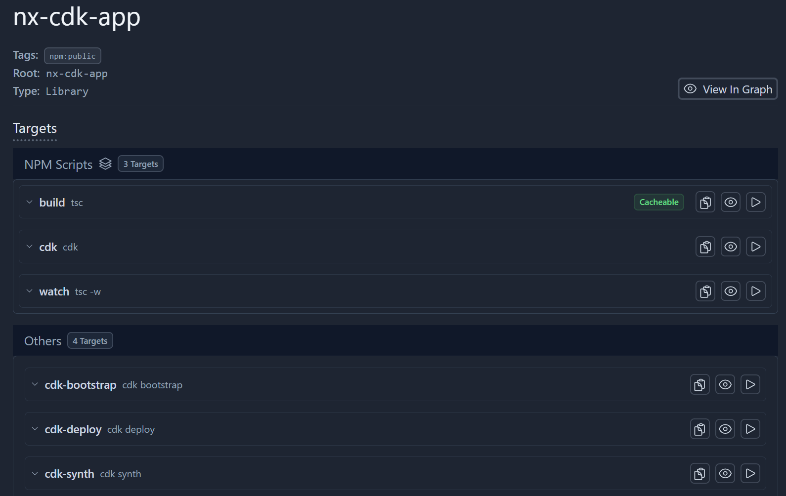

## Table of Contents

- [Install](#install)
- [Usage](#usage)
- [Example](#example)
- [Contributing](#contributing)
- [License](#license)

## Install

```shell
# npm
npm install --save-dev @plastic-ant/nx-cdk

# yarn
yarn add --dev @plastic-ant/nx-cdk
```

## Usage

Add this plugin to your `nx.json` config:

```
"plugins": [
    {
      "plugin": "@plastic-ant/nx-cdk",
      "options": { ... }
    }
]
```

```
options:
  synthTargetName        (optional) generated target synth, default cdk-synth
  deployTargetName       (optional) generated target deploy, default cdk-deploy
  bootstrapTargetName    (optional) generated target bootstrap, default cdk-bootstrap
```

## Example

This repo contains a very basic example to demo how the plugin works and how to pass additional cli arguments [here](https://github.com/plastic-ant/nx-cdk/tree/main/nx-cdk-app).



## License

This project is MIT licensed 2024 Plastic Ant Software

## Links

- [Nx](https://github.com/nrwl/nx)
- [AWS CDK](https://docs.aws.amazon.com/cdk/v2/guide/home.html)
